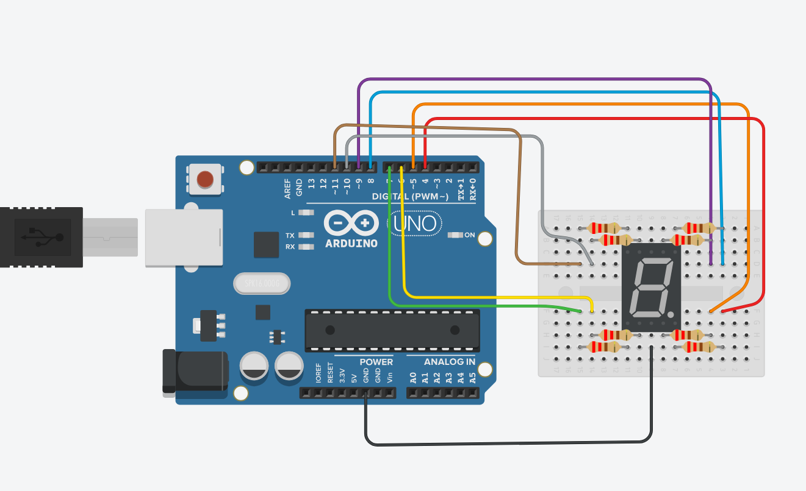

# Information about 7-segment display circuit and code

### Schematic
**Materials:**
- Arduino Uno R3
- 8 220Ω resistors
- 9 M-M jumper wires
- 7-Segment display
- Connection cord for arduino to a computer/laptop

This is how I connected each segment of the display to the arduino. If the code is not acting as intended, try trouble shooting the wires or changing the pin numbers in the code stored as global constants (ex const int CENTER = 11). The resisters are 220Ω with one connected to each cathode. There is a ground connection to the board at the bottom center pin of the display. See pinout diagram for more informaion.

If you follow the schematic and the display still doesn't turn on, its possible you have a common anode version of the display. In that case, connect the ground wire to the same location on the top part of the display instead.

### Code Walk through
There are several code files I made for this specific circuit. WIP.

